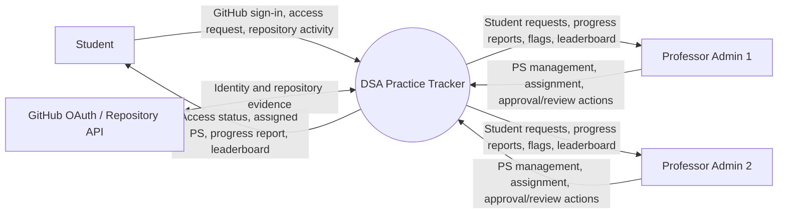
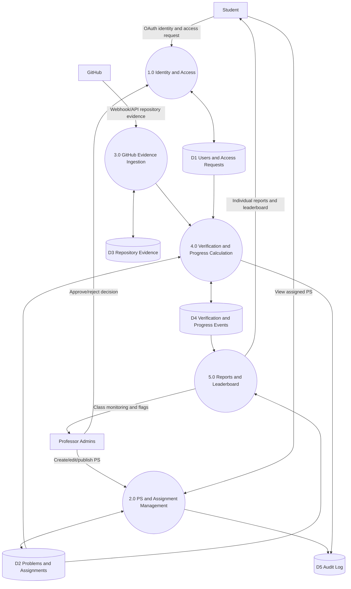
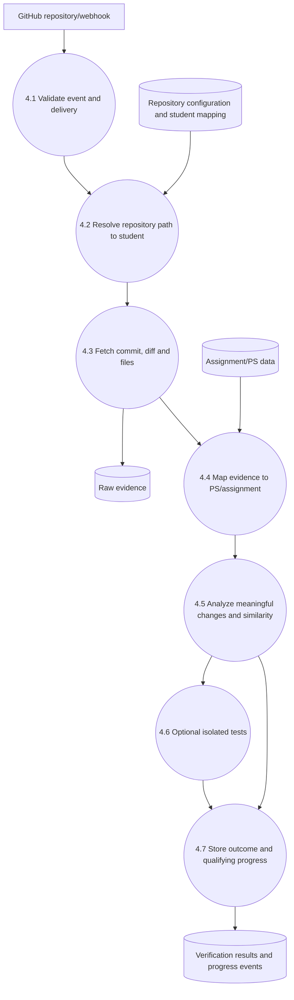
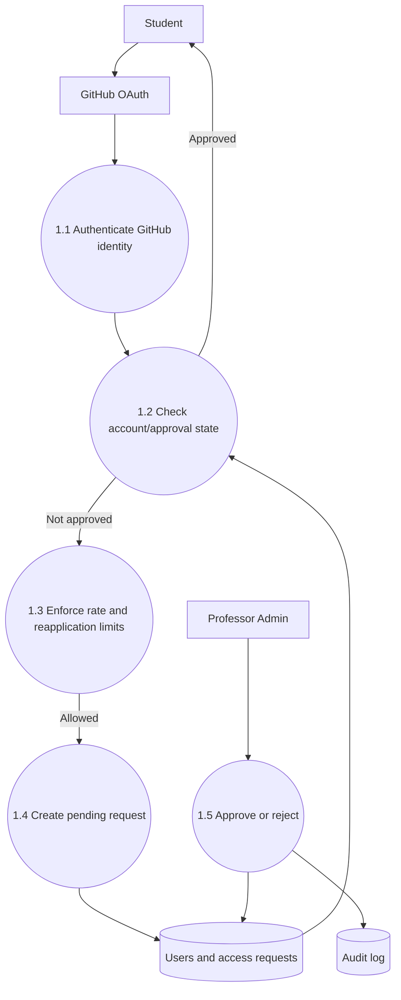

# 3. Data Flow Diagrams (DFD)

DFDs describe data movement, not code structure. Mermaid flowcharts below are readable approximations of DFDs.

## 3.1 Context diagram (Level 0)

## 3.2 DFD Level 1

## 3.3 DFD Level 2 — GitHub verification

## 3.4 DFD Level 2 — access approval

## DFD rules
- Every process that changes access, assignments or verification state must persist the outcome.
- The repository is an external evidence source; the application database is the source of truth for approval state, assignments and computed results.
- Do not let browser-supplied values determine verified progress or leaderboard scores.
