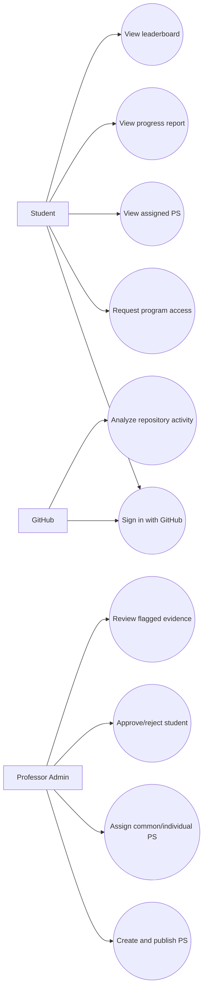
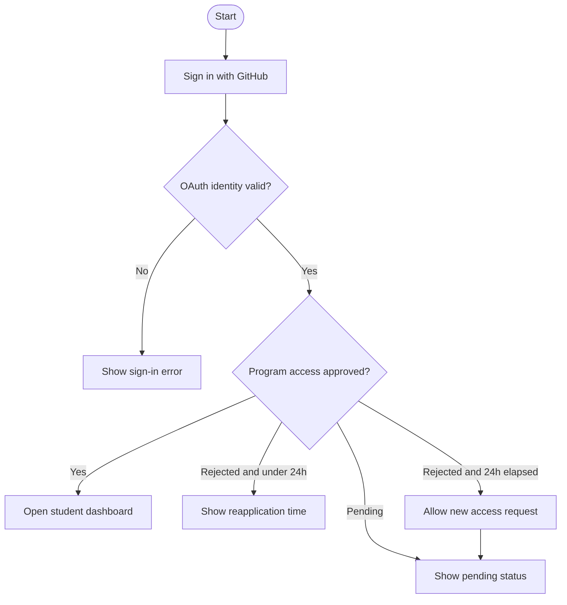
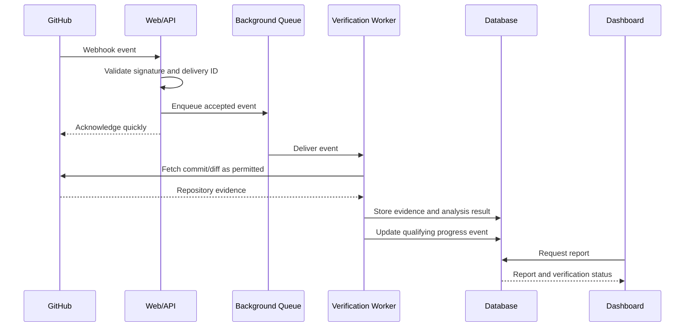

# 4. UML / Use Cases

## 4.1 Use case diagram

## 4.2 Student access activity

## 4.3 Repository event sequence

## 4.4 Use-case notes
- Student-facing endpoints must check approval on the server.
- Admin use cases require a server-side admin role.
- GitHub ingestion is asynchronous and idempotent.
- Review flags must show evidence and reason.
