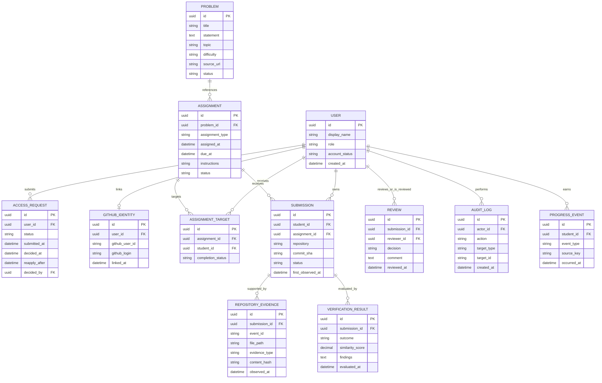

# 5. Data Model and ERD

## 5.1 ER diagram

## 5.2 Design rules
- Use immutable GitHub numeric user ID as the external identity key where available; GitHub login can change.
- Use a stable internal student ID for the folder mapping, not a display name.
- Enforce uniqueness for GitHub identity and for the active pending access request.
- Use foreign keys for student, assignment, submission and review relationships.
- Store GitHub access tokens in a secure secret store or encrypted credential storage; never store plaintext tokens in ordinary user records.
- Preserve raw evidence references and timestamps so a result can be explained and audited.
- Store similarity scores as signals, not as a definitive cheating verdict.
- A common assignment has one assignment definition and separate target/completion records for each student.
- Keep raw repository evidence separate from derived progress events so analysis rules can evolve without losing source history.

## 5.3 Open data decisions
- Database engine and migration tool.
- Retention policy for code diffs and raw evidence.
- Whether report snapshots are persisted or computed on demand.
- Exact states and transitions for PS, assignment, submission and review.
